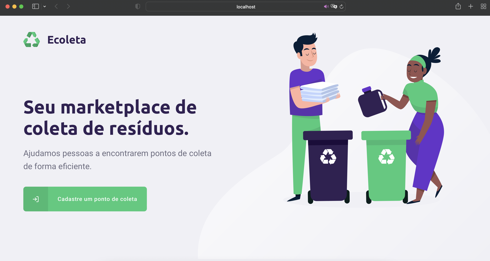
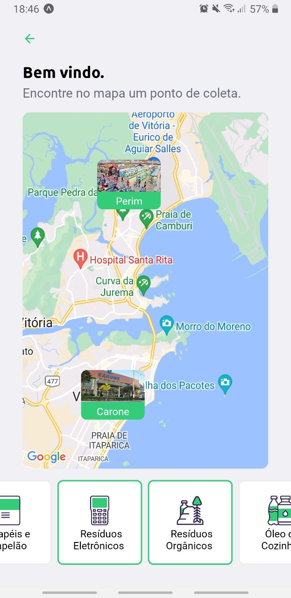
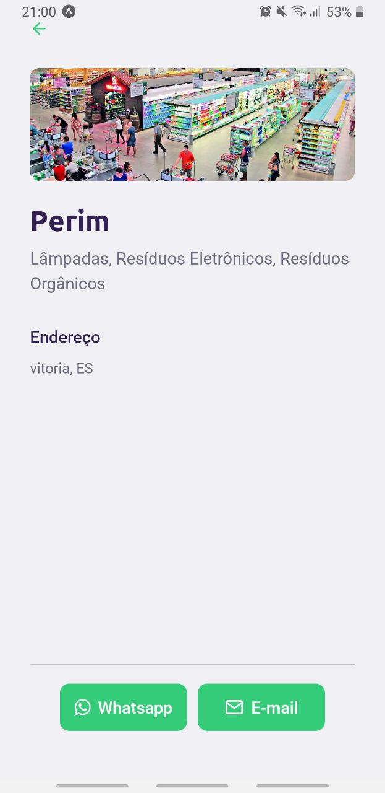
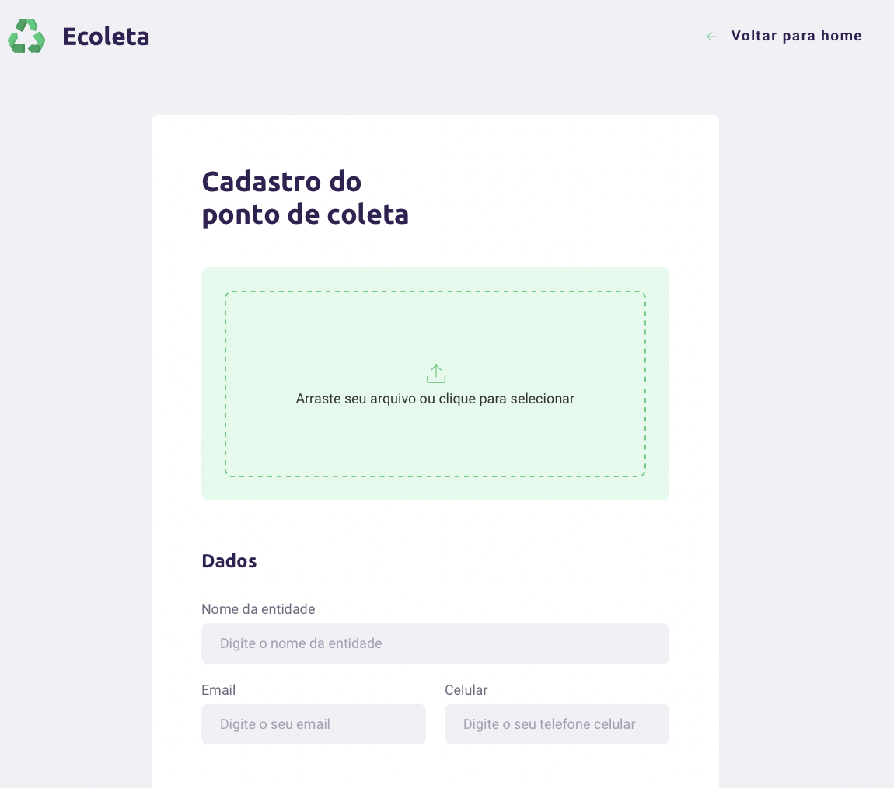
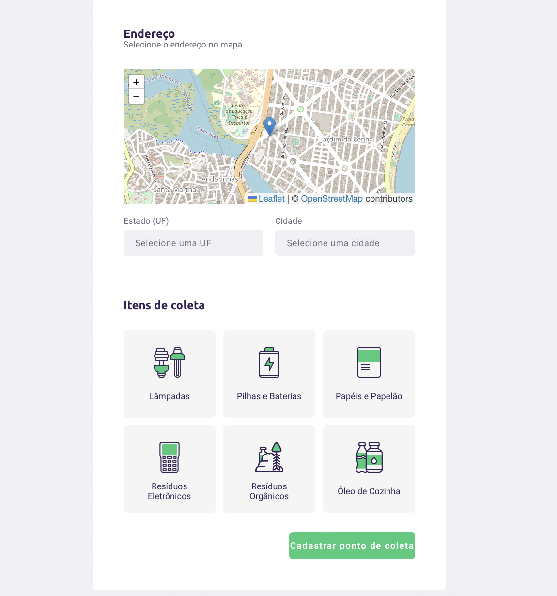

# :recycle: Ecoleta

This project implements an app and a website to help users find recycling centres.

<p align="center">
  <a href="#-project">Project</a>&nbsp;&nbsp;&nbsp;|&nbsp;&nbsp;&nbsp;
  <a href="#-technologies-and-main-packages">Technologies</a>&nbsp;&nbsp;&nbsp;&nbsp;&nbsp;&nbsp;
</p>


<p align="center">
  
</p>

## 💻 Project

#### Backend

The backend is responsable for the connection to the database, from the `server` directory, start running the following command to install all dependencies:

```
npm install
```


The database contains 3 tables: `Points` representing a recyncling collection center, `Items` representing the recyclables, `Point_Items` representing the relation between points and items. To create all tables and seed `Items` run the following commands:

```
npm run knex:migrate
npm run knex:seed
```


And finally, to run the server use the following command:

```
npm run dev
```


##### Routes
- Items:
    - `get /items`: list all items registered;

- Points:
    - `get /points`: lists all centers registered, or filtered by uf, city or items;
    - `get /points/:id`: lists a specific center registered;
    - `post /points`: lists all points registered;
    - `delete /points:id`: deletes a specific point;


#### Mobile

To start the mobile server, you may run the following commands from the root folder:

```
cd mobile
npm install
npm start
```

The app allows you to find all registered centers looking the map, and filtering by items. You can also send a message or an email to the to it.

<p align="center">
  
  
</p>


#### Web

From the web page is possible to register a new collection center. To start this server, you may run the following commands from the root folder:

```
cd web
npm install
npm start
```

<p align="center">
  
  
</p>


## 📦 Technologies and main packages

This project was developed using the following technologies:


- **Package manager**: NPM (8.19.2)
- **Language**: Typescript (4.8.4), HTML, CSS

- **Backend** ([NodeJs (18.10.0)](https://nodejs.org/) and [Sqlite3](https://www.npmjs.com/package/sqlite3))
    - [express](https://expressjs.com)
    - [knex](https://knexjs.org)
    - [multer](https://www.npmjs.com/package/multer)


- **Mobile path** ([React (18.0.0)](https://reactjs.org)): 
    - [react-navigation](https://reactnavigation.org)
    - [react-native-gesture-handler](https://docs.swmansion.com/react-native-gesture-handler/)
    - [react-native-maps](https://docs.expo.dev/versions/latest/sdk/map-view/)
    - [expo-mail-composer](https://docs.expo.dev/versions/latest/sdk/mail-composer/)

- **Web path** ([React Native (0.69.6)](https://reactnative.dev)): 
    - [expo](https://expo.dev)
    - [react-dropzone](https://react-dropzone.js.org)
    - [leaflet](https://leafletjs.com)
    - [react-router-dom](https://v5.reactrouter.com/web/guides/quick-start)

- **Connection**:
    - [axios](https://axios-http.com)
